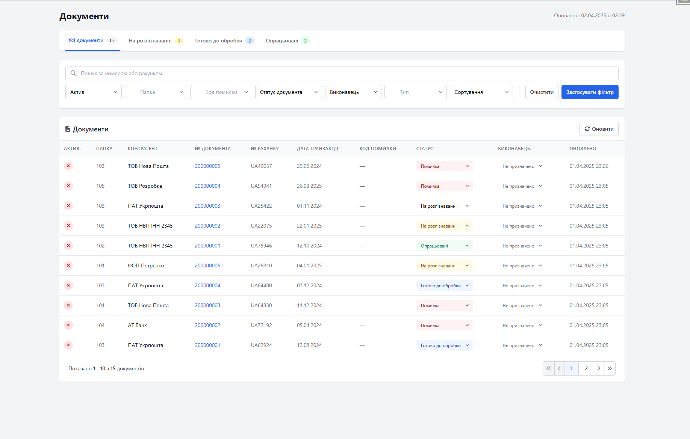
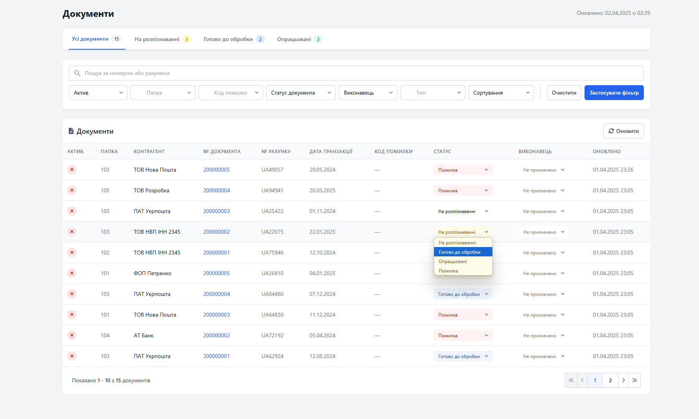
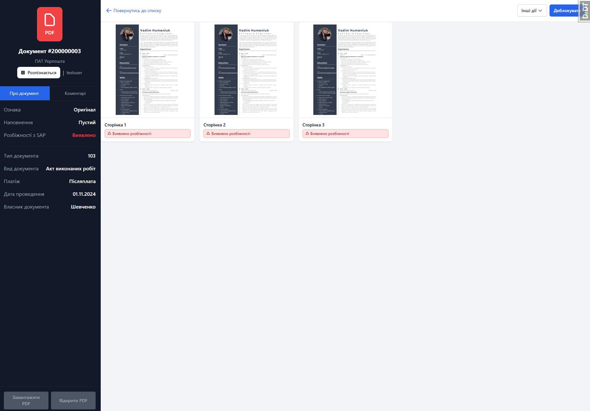
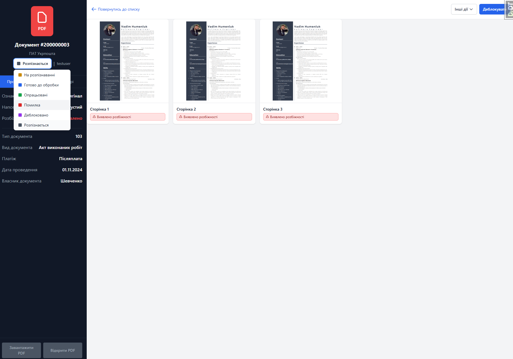
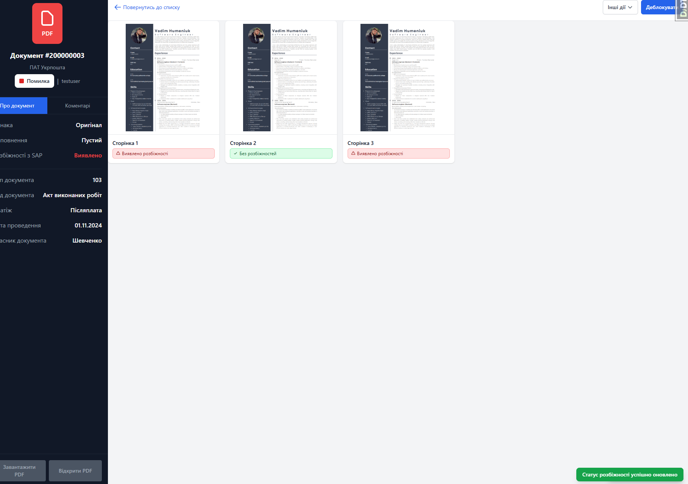

# PDF Document Mini CRM

Простий Django застосунок для управління PDF документами (міні-CRM система).

## Опис проекту

Цей проект реалізує систему управління документами з наступними можливостями:
- Відображення списку документів з фільтрами та сортуванням
- Детальний перегляд документів з інформацією та прикріпленими файлами
- Управління статусами документів
- Адміністративна панель для повного керування

## Структура проекту

Проект має наступну структуру директорій:
```
django-pdf-document-mini-CRM/
├── apps/                     # Директорія для всіх застосунків Django
│   ├── __init__.py
│   └── documents/            # Застосунок для роботи з документами
├── config/                   # Налаштування проекту
├── media/                    # Директорія для завантажених файлів
├── templates/                # Глобальні шаблони
│   ├── base.html             # Базовий шаблон
│   └── documents/            # Шаблони для документів
├── manage.py
└── README.md
```

## URL-адреси та навігація

### Основні URL-адреси:
- `/` або `/documents/` - Список документів (головна сторінка)
- `/documents/<id>/` - Детальний перегляд документу з ідентифікатором `<id>`
- `/admin/` - Адміністративна панель Django

### Авторизація:
- `/accounts/login/` - Сторінка входу в систему
- `/accounts/logout/` - Вихід із системи

Для доступу до системи необхідно увійти через сторінку авторизації, використовуючи створені раніше облікові дані.

## Моделі

### Document
- number - номер документа
- contractor - контрагент
- date - дата документа
- doc_type - тип документа
- folder - папка/категорія
- status - статус документа
- error_code - код помилки
- executer - виконавець

### DocumentPage
- document - зв'язок з документом
- file_path - файл сторінки
- page_name - назва сторінки
- discrepancy_found - ознака розбіжностей
- copy_original - ознака (копія/оригінал)
- completeness - наповнення (повний/наповнюється/пустий)

## Встановлення та запуск

### Підготовка середовища

1. Клонуйте репозиторій:
```bash
git clone https://github.com/SpasiboVadya/django-pdf-document-mini-CRM.git
cd django-pdf-document-mini-CRM
```

2. Створіть та активуйте віртуальне середовище:
```bash
python -m venv venv
source venv/bin/activate  # для Linux/Mac
venv\Scripts\activate     # для Windows
```

3. Встановіть залежності:
```bash
pip install -r requirements.txt
```

### Налаштування

1. Налаштування змінних середовища (опціонально):
   - Створіть файл `.env` в корні проекту зі змістом:
   ```
   DEBUG=True
   SECRET_KEY=your-secret-key
   DATABASE_URL=sqlite:///db.sqlite3
   ```

2. Налаштування бази даних:
   - За замовчуванням проект використовує SQLite
   - Для використання інших СУБД (PostgreSQL, MySQL) змініть налаштування в `config/settings.py`

3. Створіть та застосуйте міграції:
```bash
python manage.py makemigrations
python manage.py migrate
```

4. Створіть суперкористувача для доступу до адмін-панелі:
```bash
python manage.py createsuperuser
```

### Запуск проекту

1. Запустіть сервер розробки:
```bash
python manage.py runserver
```

2. Відкрийте браузер та перейдіть за адресою:
   - http://127.0.0.1:8000/ - Головна сторінка
   - http://127.0.0.1:8000/admin/ - Адміністративна панель

## Генерація Тестових Даних

Для наповнення бази даних тестовими даними використовуйте команду:

```bash
# Базове використання (створить 10 документів по 3 сторінки)
python manage.py seed_data

# Створення конкретної кількості документів та сторінок
python manage.py seed_data --documents 20 --pages-per-document 5

# Використання власного зображення замість PDF
python manage.py seed_data --image-path path/to/your/image.png
```

Команда створить:
- Тестового користувача (якщо не існує):
  - Логін: testuser
  - Пароль: testpass123
- Вказану кількість документів з випадковими даними
- Вказану кількість сторінок для кожного документа

## Основні функції

- Управління PDF документами
- Відстеження статусу документів
- Система користувачів та ролей
- Пошук та фільтрація документів
- Перегляд та завантаження PDF файлів

## Технології
- Python 3.8+
- Django 4.2+
- Bootstrap 5
- HTML/CSS/JavaScript
- Tailwind CSS 

## Вирішення проблем

### Помилка при запуску міграцій
Якщо при запуску міграцій виникають помилки:
```bash
python manage.py migrate --run-syncdb
```

### Проблеми з доступом до адміністративної панелі
Перевірте, чи створений суперкористувач:
```bash
python manage.py createsuperuser
```

### Не відображаються статичні файли
Переконайтеся, що в режимі розробки `DEBUG=True` в налаштуваннях проекту. 

## Короткий огляд функціональності

PDF Document Mini CRM - це веб-система для керування документами, що забезпечує зручний спосіб організації, перегляду та обробки PDF-документів. Основні можливості:

- **Керування документами**: завантаження, перегляд і організація документів у єдиному інтерфейсі
- **Відстеження статусів**: зміна та моніторинг статусів обробки кожного документа
- **Пошук та фільтрація**: розширені фільтри для швидкого знаходження потрібних документів
- **Управління розбіжностями**: відмітка та відстеження розбіжностей у документах
- **Призначення виконавців**: можливість призначати відповідальних за документи
- **Адміністрування**: повний адміністративний доступ через Django Admin

Система спеціально розроблена для оптимізації робочих процесів, пов'язаних з документообігом, та підвищення ефективності роботи з документами.

## Скріншоти

### Головна сторінка - список документів

*Головна сторінка програми з відображенням списку документів, фільтрами та таблицею результатів*

### Зміна статусу на головній сторінці

*Сторінка детального перегляду документа з бічною панеллю інформації та відображенням сторінок*

### Форма фільтрації документів

*Розширений фільтр для пошуку документів з різними параметрами*

### Сторінка документа



### Керування статусами документів



###   Управління розбіжностями

*Інтерактивне управління статусом розбіжностей для сторінок документа*